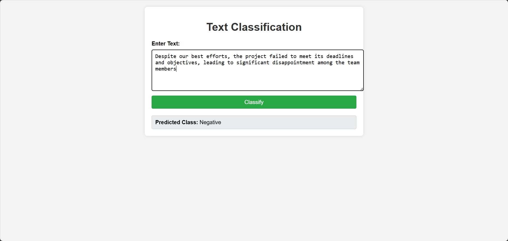

## Sentiment Analysis

Sentiment analysis, also known as opinion mining, is a subfield of natural language processing (NLP) that focuses on identifying and extracting subjective information from text data. It involves determining the sentiment expressed in a piece of text, which can be classified as positive, negative, neutral,Irrelevent or more fine-grained categories depending on the application.

### Dataset

The dataset used in this sentiment analysis project is a Twitter dataset obtained from a Kaggle competition.Twitter datasets are particularly valuable for sentiment analysis due to the platform's wide range of user-generated content, which provides a diverse set of opinions and sentiments.The Twitter dataset consists of tweets that have been labeled with sentiment annotations. Each tweet includes information that helps in analyzing the sentiment expressed by users. Key features of the dataset include:

* **Tweet Text** : The actual text content of the tweet.
* **Sentiment Label** : The sentiment associated with the tweet, typically categorized as positive, negative, neutral, or other sentiment classes defined by the dataset.

### Model

The sentiment analysis model used in this project is fine-tuned on DistilBERT, specifically the `distilbert-base-uncased` variant. DistilBERT is a smaller, faster, and lighter version of BERT (Bidirectional Encoder Representations from Transformers), designed to retain much of BERT's accuracy while being more efficient.Fine-tuning involves taking a pre-trained DistilBERT model and further training it on the Twitter sentiment dataset. This process allows the model to adapt to the specific nuances and characteristics of the Twitter data, improving its performance on sentiment classification tasks.

### Test Model

1. Clone the repository

   `git clone https://github.com/sumairrasi/sentiment-analysis.git`
2. Navigate to the cloned repository directory:

   `cd sentiment-analysis `
3. Build the docker image

   `docker build -t sentiment_analysis .`
4. Run the Docker Container

   `docker run -p 5000:5000 sentiment_analysis `

   The page would be

   

### Finetuning

For the finetuning create or append your custom dataset. It must contains 'Content' and 'Label'. place your dataset inside data folder

and change the dataset path in `src\components\data_ingestion.py`

Then install `pip install -r requirements.txt`

Now run `train_data.py` with required parameters train size and test size ratio for example:

```
python train.py --train_size 0.8 --test_size 0.2
```

**To do**

To further enhance and extend the capabilities of this sentiment analysis project, the following tasks and research areas have been identified for future work:

1. **Handle Long Text Sequences** : Explore techniques such as hierarchical attention mechanisms, Longformer, or BigBird models to effectively manage longer texts.
2. **Adversarial Training Methods for Semi-supervised Text Classification** : mplement adversarial training techniques that create challenging examples during training, improving the model's generalization capabilities, especially in semi-supervised learning settings.
3. **Multilingual Sentiment Analysis** : Fine-tune multilingual models like mBERT or XLM-R on sentiment datasets from various languages to create a versatile sentiment analysis tool.
4. **Incorporate More Advanced Preprocessing Techniques** : Implement techniques such as named entity recognition (NER), part-of-speech tagging, and syntactic parsing to enrich the text data before feeding it into the model.
5. **Real-time Sentiment Analysis** : Develop a pipeline that can handle live data streams, preprocess the data in real-time, and deliver instant sentiment analysis results.
